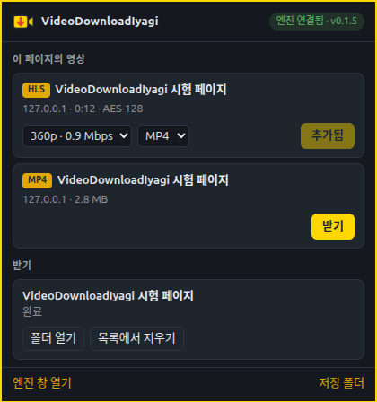

<p align="center"></p>

# VideoDownloadIyagi (비디오다운로드이야기)

브라우저에서 재생되는 영상을 찾아 **PC 에 저장**합니다.

**브라우저 확장**이 영상을 찾고, PC 에 설치하는 **VideoDownloadIyagi 엔진**이 받습니다.
브라우저 안에서 받지 않으므로 큰 영상도 빠르고, 브라우저를 닫아도 다운로드가 계속됩니다.

<p align="center"></p>

---

## ✨ 주요 기능

* **자동 감지** — 페이지가 재생하는 HLS(m3u8)·MP4·WebM 등을 네트워크에서 바로 찾아 도구 모음 배지로 표시
* **화질·음성 선택** — HLS 의 여러 화질(1080p·720p…)과 음성 트랙 중에서 고르기
* **빠른 다운로드** — HLS 조각 6개 동시, 큰 파일은 4갈래로 나눠 동시에
* **이어받기** — 끊기거나 일시정지해도 받은 데까지 이어서
* **무손실 합치기** — 영상·음성을 재인코딩 없이 MP4 / MKV 로 (FFmpeg 필요)
* **AES-128 HLS** — 표준 암호화 스트림 지원
* **로그인 유지** — 브라우저가 쓰던 쿠키·헤더로 받고, 만료되면 확장에서 새로 받아 이어감
* **트레이 상주 엔진** — 작업 목록·진행률·완료 알림, 브라우저를 닫아도 계속
* **지원 브라우저** — Chrome · Edge · Chromium · Brave · Vivaldi (Firefox 준비 중)

## 📥 설치

### 1. 엔진

[**Releases**](https://github.com/iyagicom/VideoDownloadIyagi/releases/latest) 에서 내 시스템에 맞는 파일을 받습니다.

| 시스템 | 파일 |
|---|---|
| Ubuntu 24.04 | `videodownloadiyagi_<버전>.ubuntu24.04_amd64.deb` |
| Ubuntu 26.04 | `videodownloadiyagi_<버전>.ubuntu26.04_amd64.deb` |
| Fedora | `videodownloadiyagi-<버전>-1.x86_64.rpm` |
| Arch | `videodownloadiyagi-<버전>-1-x86_64.pkg.tar.zst` |
| 그 밖의 리눅스 | `.AppImage` 또는 `.zip` |

```bash
sudo apt install ./videodownloadiyagi_*ubuntu26.04_amd64.deb
```

deb·rpm·pkg.tar.zst 는 설치만 하면 브라우저에 연결됩니다. AppImage·zip 은 **한 번 실행**하면 스스로 연결합니다.
영상·음성을 합치려면 `ffmpeg` 이 필요합니다(`sudo apt install ffmpeg`) — 없으면 트랙을 따로 저장합니다.

### 2. 브라우저 확장

크롬 웹 스토어 등록 전까지는 압축 해제 확장으로 설치합니다.

1. Releases 의 `videodownloadiyagi-extension-<버전>.zip` 을 받아 압축을 풉니다
   (deb·rpm·zst 로 설치했다면 `/usr/share/videodownloadiyagi/extension` 에 이미 있습니다)
2. 주소창에 `chrome://extensions` (Edge 는 `edge://extensions`) → 오른쪽 위 **개발자 모드** 켜기
3. **압축해제된 확장 프로그램을 로드합니다** → 그 폴더 선택
4. 영상을 재생하고 도구 모음의 아이콘을 눌러 **엔진 연결됨** 이 보이면 끝

## ⚠️ 받을 수 없는 것

DRM(Widevine · PlayReady · FairPlay)으로 보호된 콘텐츠는 받지 않으며, 보호를 우회하는 기능도 없습니다.
YouTube 등 스트리밍 서비스는 지원하지 않습니다.
정당하게 볼 수 있는 영상만 개인 보관용으로 저장하세요.

## 🔒 개인정보

쿠키·로그인 정보는 다운로드하는 동안 엔진 메모리에만 두고 파일이나 기록에 남기지 않습니다.
확장과 엔진은 같은 PC 안에서만 통신하며(외부 서버 없음), 로컬 네트워크 포트도 열지 않습니다.
